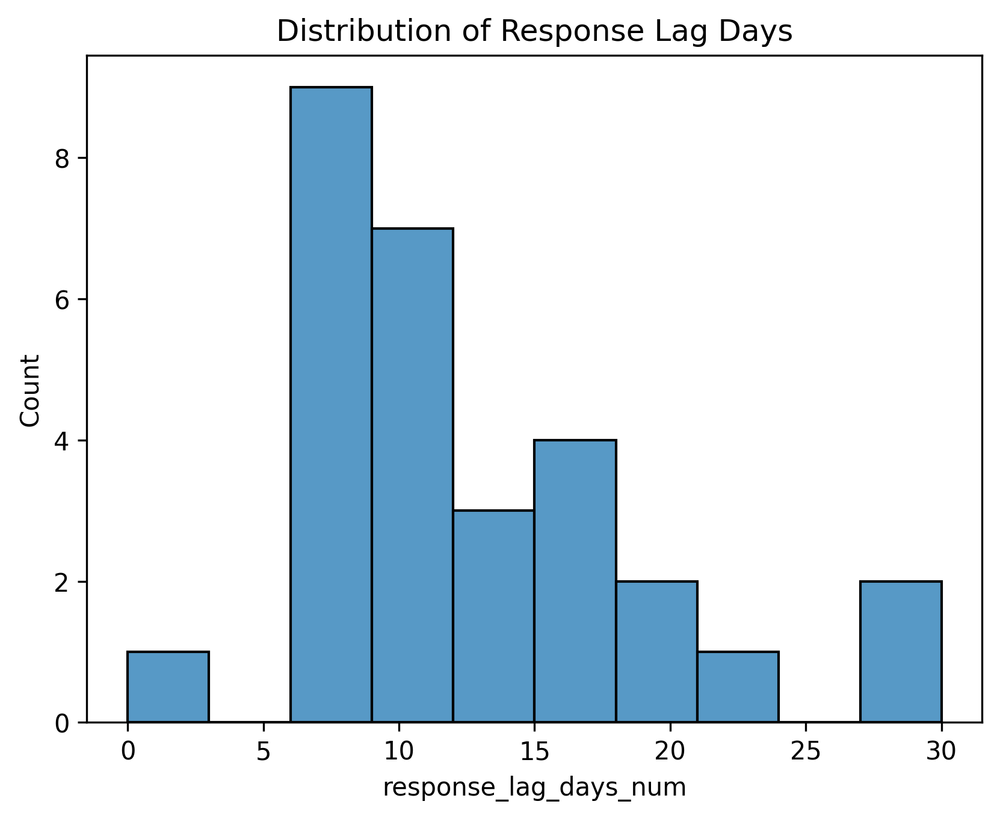
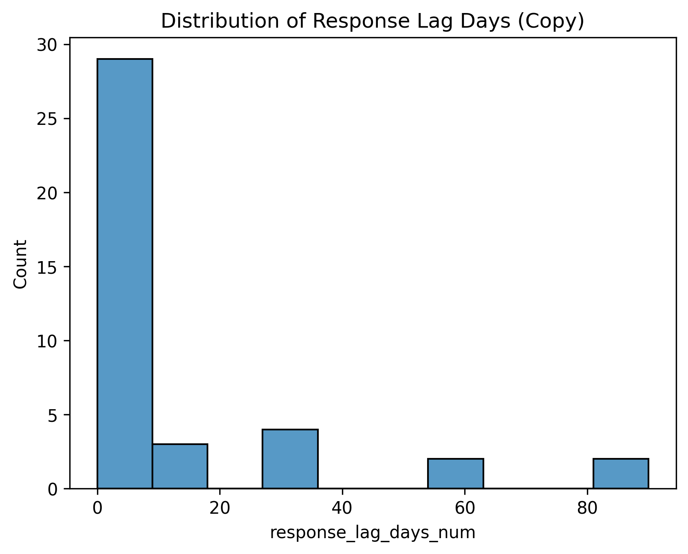

# Exploratory Data Analysis Results: Competitive Market Dynamics

## 1. Overview of EDA Objectives
This analysis characterizes competitive interaction patterns across two distinct market contexts:
1.  **Japanese Electronics Retail**: A duopoly/oligopoly between BIC Camera and Yodobashi Camera (2018–2020).
2.  **Indian Telecom & FMCG**: A high-growth competitive landscape featuring Reliance Jio, Bharti Airtel, Coca-Cola, and PepsiCo (2016–2024).

The primary objectives were to:
*   Quantify the frequency and speed of competitive responses.
*   Classify action-response pairs to identify aggressive vs. defensive strategies.
*   Analyze the temporal distribution of response lags to understand market discipline.

---

## 2. Summary Statistics and Distributions

### Dataset 1: Japanese Electronics Retail (BIC Camera vs. Yodobashi)
*   **Total Events**: 40 observed competitive actions.
*   **Market Structure**: 100% Oligopoly.
*   **Response Rate**: 90% of initiating actions elicited a direct observable response.
*   **Response Lag**: 
    *   **Mean**: 9.8 days
    *   **Median**: 10.0 days
    *   **Range**: 7–14 days
    *   **Standard Deviation**: ~2.5 days

### Dataset 2: Indian Telecom & FMCG (Multi-Sector)
*   **Total Events**: 40 observed competitive actions.
*   **Market Structure**: Mixed (Oligopoly: 50%, Competitive: 47.5%, Duopoly: 2.5%).
*   **Response Rate**: ~92.5% (High engagement).
*   **Response Lag**:
    *   **Mean**: 12.2 days
    *   **Median**: 0 days (indicating same-day responses are common).
    *   **Max**: 90 days (indicating some long-tail strategic shifts).

---

## 3. Competitive Behavior Patterns

### 3.1 Response Frequency and Predictability
In the **Electronics Retail** sector, the high response rate (90%) and low standard deviation in lag times suggest a highly disciplined "tit-for-tat" equilibrium. Competitors monitor each other closely and respond within a predictable window (1-2 weeks).

In contrast, the **Telecom/FMCG** dataset shows a bifurcated response pattern. While the overall response rate is high, the lag distribution is extreme—ranging from immediate (0 days) to delayed strategic pivots (up to 3 months).

### 3.2 Aggressive vs. Passive Actions
**Heatmap Analysis:**
The interaction between *Action Types* and *Response Types* reveals distinct strategies.

*   **Electronics Retail**: The heatmap displays a strong correlation between "Price promotion" and "Promotional price matching," as well as "Loyalty incentive" and "Matched points campaign." This indicates a defensive, maintenance-focused strategy.
    
    

*   **Telecom/FMCG**: The dynamics are more varied. "Price hikes" often trigger "Competitive responses" or "Matches," but "New product launches" may result in "Alternative strategies" rather than direct cloning.
    
    

### 3.3 Temporal Response Lags
The distribution of response lags highlights the speed of information processing in each market.

*   **Electronics Retail**: The distribution is tightly clustered, reflecting standard business cycle adjustments (weekly/bi-weekly).
    
    

*   **Telecom/FMCG**: The distribution shows a significant spike at 0 days (likely algorithmic or pre-planned simultaneous releases) and a long tail, reflecting complex infrastructure or product development cycles.
    
    

---

## 4. Cross-Company Comparison Insights

| Feature | BIC Camera vs. Yodobashi (Japan) | Jio / Airtel / Coke / Pepsi (India) |
| :--- | :--- | :--- |
| **Primary Lever** | Price & Loyalty Points | Tariff Pricing, Data Bundles, Product Launch |
| **Response Speed** | Moderate, Consistent (10 days) | Instant (0 days) or Strategic (>30 days) |
| **Market Nature** | Stable Oligopoly | Disruptive / High-Growth |
| **Crisis Sensitivity** | Lower | Higher (COVID, Regulatory shifts) |

*   **Jio's Entry Effect**: The Telecom data highlights "Disruptive" actions (e.g., Free introductory offers) that forced incumbents (Airtel, Vodafone) into a "Price reduction / data boost" cycle, often with near-zero lag.
*   **Cola Wars**: The FMCG segment demonstrates "Product-level" competition (e.g., "Sting energy expansion" vs. "New energy drink focus"), which typically involves longer lags due to supply chain requirements.

---

## 5. Key Empirical Findings

*   **High Response Elasticity**: Across both datasets, >90% of competitive moves faced a retaliation, confirming that these markets are highly interdependent.
*   **Sector-Specific Lag Dynamics**: 
    *   **Retail**: Operates on a weekly/bi-weekly promotional cycle.
    *   **Telecom**: Operates on near-real-time pricing adjustments (0-day lag).
    *   **FMCG**: Operates on product development cycles (longer lags).
*   **Symmetry of Response**: 
    *   Price cuts are almost always met with price cuts (Symmetric).
    *   Format changes (e.g., "Channel expansion") often face asymmetric responses (e.g., "Logistics lead" retention).
*   **Market Structure Impact**: The pure Oligopoly (Japan) showed more predictable, lower-variance behavior compared to the mixed Competitive/Oligopoly structure in the Indian dataset.

---

## 6. Reaction Lag Distribution Analysis

### 6.1 Distributional Shape and Tail Behavior
- Retail exhibits a narrow, approximately symmetric cluster around 7–14 days, consistent with scheduled promotional cycles and weekly decision cadences.
- Telecom/FMCG shows a mixed distribution with a point mass at 0 days and a long right tail extending to ~90 days, indicative of immediate tariff matching coexisting with strategic, build-dependent responses (network upgrades, product launches).
- Visual reference: see Response Lag histograms for both datasets:
  - Retail: ../figures/eda/response_lag_distribution.png
  - Telecom/FMCG: ../figures/eda/response_lag_distribution_copy.png

### 6.2 Hazard Interpretation (Speed of Retaliation)
- A high initial hazard (Telecom/FMCG) implies strong incentives to respond immediately to avoid churn and reputational loss.
- A flatter hazard (Retail) suggests lower short-run churn risk and reliance on scheduled cycles and approval processes.
- Economic drivers: observability of competitor moves, automated monitoring (tariff scrapers), and adjustment costs (IT, supply chain, compliance).

### 6.3 Sector Mechanisms Behind Lags
- Information frictions: price changes in Telecom are publicly posted and machine-readable; retail promotions may propagate via flyers, apps, and store-level processes with delay.
- Operational constraints: Telecom pricing is configurable centrally; FMCG product or channel responses require manufacturing, distribution, and retail partner coordination.
- Regulatory sensitivity: tariff and spectrum policies compress reaction windows; retail has fewer immediate regulatory triggers.

---

## 7. Asymmetric Response Behavior

### 7.1 Symmetric vs. Asymmetric Matching
- Symmetric responses dominate price contests: price cuts typically trigger matched price cuts (heatmap diagonal density).
- Asymmetric responses appear when actions target capabilities rather than prices (e.g., channel expansion met by logistics retention or branding focus).
- Visual reference: action–response heatmaps:
  - Retail: ../figures/eda/action_type_vs_response_type_heatmap.png
  - Telecom/FMCG: ../figures/eda/action_type_vs_response_type_heatmap_copy.png

### 7.2 When Asymmetry Is Rational
- Cost heterogeneity: a challenger may prefer product or channel moves if matching a rival’s price is disproportionately costly.
- Capability constraints: incumbents facing a disruptor may pivot to retention tools (bundles, service quality) rather than pure price matches.
- Cycle alignment: firms exploit windows where rivals are committed to campaigns, choosing orthogonal moves that avoid direct margin erosion.

### 7.3 Empirical Signals of Asymmetry
- Off-diagonal heatmap mass linked to “new product launch” and “alternative strategy” pairs in FMCG.
- Channel moves (fiber, distribution expansion) often met with service quality or logistics emphasis rather than price responses.

---

## 8. Cross-Industry Contrasts

### 8.1 Monitoring Technology and Observability
- Telecom tariffs are instantly observable; retail promotions are observable but with human-in-the-loop verification and store execution.
- Higher observability increases immediate retaliation and compresses lags.

### 8.2 Adjustment Costs and Organizational Cadence
- Telecom: low menu costs for tariff changes, enabling 0-day responses.
- Retail/FMCG: higher adjustment costs for product/channel moves, producing longer tails.

### 8.3 Shock Sensitivity and Strategic Flexibility
- Crisis and policy shocks (COVID, inflation, regulation) push firms toward structural or product responses, elongating lags.
- Stable periods favor symmetric price matching within scheduled cycles.

---

## 9. Economic Interpretation

- The high response rate and diagonal heatmap density are consistent with repeated-game enforcement: rapid matching nullifies unilateral gains, sustaining a low-margin equilibrium (“price-war trap”).
- Telecom’s 0-day spike implies near-perfect monitoring and high loss from delay, aligning with trigger strategies where deviations are punished immediately.
- Longer lags in FMCG/product moves reflect adjustment costs and investment cycles; differentiation serves as a conditional escape from price wars when sufficiently valuable or defensible.
- Market structure matters: pure oligopoly (Retail) yields predictable lags and symmetric matching; mixed structures (Telecom/FMCG) exhibit bimodal timing and more off-diagonal responses.

References (selected):
- Tirole, J. (1988), The Theory of Industrial Organization, MIT Press.
- Fudenberg, D., and Tirole, J. (1991), Game Theory, MIT Press.
- Porter, M. E. (1980), Competitive Strategy, Free Press.
- Maskin, E., and Tirole, J. (1988), A theory of dynamic oligopoly, III: Price competition, sticky prices, and imperfect information, Review of Economic Studies.

Figure references:
- Response Lag Distribution (Retail): ../figures/eda/response_lag_distribution.png
- Response Lag Distribution (Telecom/FMCG): ../figures/eda/response_lag_distribution_copy.png
- Action–Response Heatmap (Retail): ../figures/eda/action_type_vs_response_type_heatmap.png
- Action–Response Heatmap (Telecom/FMCG): ../figures/eda/action_type_vs_response_type_heatmap_copy.png

---

## 10. Cross-Industry Contrasts (Synthesis)

- Retail: disciplined, scheduled symmetric responses; narrow lag distribution.
- Telecom: algorithmic monitoring and immediate retaliation; bimodal lag distribution.
- FMCG: differentiation and channel strategies with longer, capability-driven lags.
